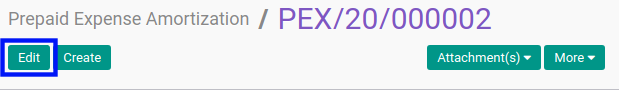
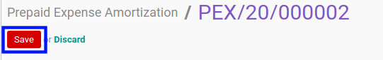

# Memodifikasi Prepaid Expense Amortization

## A. INPUT

* Data prepaid expense amortization yang dapat dimodifikasi harus memiliki status **Draft**.
* User yang akan memodifikasi harus memiliki akses untuk memodifikasi prepaid expense amortization.

## B. LANGKAH KERJA

1. Buka menu **Accounting -> Amortization -> Prepaid Expenses**. Abaikan jika sudah berada pada menu yang dimaksud.
2. Buka data prepaid expense amortization yang akan dimodifikasi. Abaikan jika data sudah dibuka.
3. Klik tombol **Edit** pada bagian atas-kiri form.

4. Ubah **[# Document](./penjelasan.md#field-#document)** jika dibutuhkan. Wajib diisi.
5. Pilih dan sesuaikan **[Move Line](./penjelasan.md#field-move-line)** jika dibutuhkan. Wajib diisi.
6. Pilih dan sesuaikan **[Journal](./penjelasan.md#field-journal)** jika dibutuhkan. Wajib diisi.
7. Pilih dan sesuaikan **[Amortization Contra Account](./penjelasan.md#field-amortization-contra-account)** jika dibutuhkan. Wajib diisi.
8. Pilih dan sesuaikan **[Analytic Account](./penjelasan.md#field-analytic-account)** jika dibutuhkan. Tidak wajib diisi.
9. Beralih ke tab **[Amortization Schedule](./penjelasan.md#tab-amortization-schedule)**.
10. Pilih dan sesuaikan tanggal **[Start Amortization](./penjelasan.md#field-start-amortization)** jika dibutuhkan. Wajib diisi.
11. Pilih dan sesuaikan **[Period](./penjelasan.md#field-period)** jika dibutuhkan. Wajib diisi.
12. Isi dan sesuaikan **[Period Number](./penjelasan.md#field-period-number)** jika dibutuhkan. Wajib diisi.
13. Klik tombol **Save** pada bagian atas-kiri form.

## C. OUTPUT

* Data prepaid expense amortization akan berubah sesuai dengan perubahan yang dilakukan.
