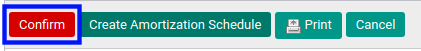
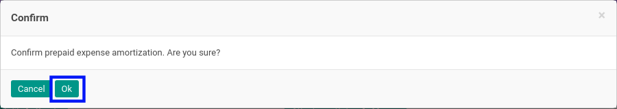

# Mengkonfirmasi Prepaid Expense Amortization

## A. INPUT

* Data prepaid expense amortization yang akan dikonfirmasi harus memiliki status **Draft**.

* User yang akan mengkonfirmasi harus memiliki akses untuk mengkonfirmasi prepaid expense amortization.

## B. LANGKAH KERJA

1. Buka menu **Accounting -> Amortization -> Prepaid Expense**. Abaikan jika sudah berada pada menu yang dimaksud.
2. Buka data prepaid expense amortization yang akan dikonfirmasi. Abaikan jika data sudah dibuka.
3. Klik tombol **Confirm** pada bagian atas-kiri form.

4. Klik tombol **Ok** pada *pop-up* konfirmasi confirm yang muncul.

## C. OUTPUT

* Status dari prepaid expense amortization akan berubah menjadi **Waiting for Approval**.

* Isian prepaid expense amortization sudah tidak bisa diubah.
