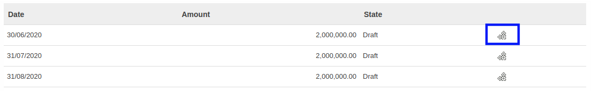
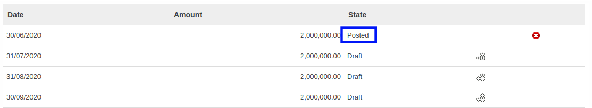

# Membuat Journal Entry Prepaid Expense Amortization Secara Manual

## A. INPUT

* Data prepaid expense amortization yang akan dibuat journal entry secara manual harus memiliki status **In Progress**.

* User yang akan membuat journal entry prepaid expense amortization secara manual harus memiliki akses untuk membuat journal entry prepaid expense amortization.

## B. LANGKAH KERJA

1. Buka menu **Accounting -> Amortization -> Prepaid Expense**. Abaikan jika sudah berada pada menu yang dimaksud.
2. Buka data prepaid expense amortization yang akan dibuat journal entry secara manual. Abaikan jika data sudah dibuka.
3. Beralih ke tab **[Amortization Schedule](./penjelasan.md#tab-amortization-schedule)**.
4. Klik icon *create account move* pada tabel bagian kanan **Amortization Schedule** yang akan dibuat journal entry.

5. Ulangi langkah ke-4 untuk setiap **Amortization Schedule** yang akan dibuat journal entry.

## C. OUTPUT

* State dari data prepaid expense amortization akan berubah menjadi **Posted**.

