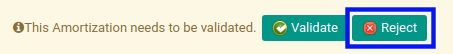

# Menolak Prepaid Expense Amortization

## A. INPUT

* Prepaid Expense amortization yang dapat ditolak harus memiliki status **Waiting for Approval**.

* User yang akan menolak harus memiliki akses untuk menolak prepaid expense amortization.

## B. LANGKAH KERJA

1. Buka menu **Accounting -> Amortization -> Prepaid Expenses**. Abaikan jika sudah berada pada menu yang dimaksud.
2. Buka data prepaid expense amortization yang akan ditolak. Abaikan jika data sudah dibuka.
3. Klik tombol **Reject** pada bagian atas-kiri form.

## C. OUTPUT

* Data prepaid expense amortization telah ditolak.

