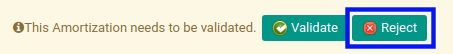

# Menolak Prepaid Income Amortization

## A. INPUT

* Prepaid income amortization yang dapat ditolak harus memiliki status **Waiting for Approval**.

* User yang akan menolak harus memiliki akses untuk menolak prepaid income amortization.

## B. LANGKAH KERJA

1. Buka menu **Accounting -> Amortization -> Prepaid Incomes**. Abaikan jika sudah berada pada menu yang dimaksud.
2. Buka data prepaid income amortization yang akan ditolak. Abaikan jika data sudah dibuka.
3. Klik tombol **Reject** pada bagian atas-kiri form.

## C. OUTPUT

* Data prepaid income amortization telah ditolak.

