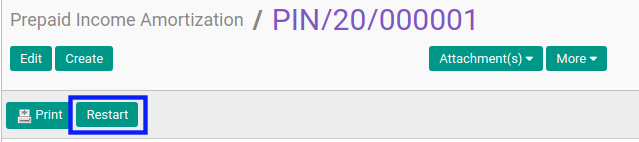
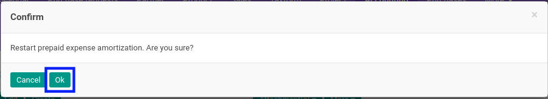

# Merestart Prepaid Income Amortization

## A. INPUT

* Data prepaid income amortization yang akan direstart harus memiliki status **Cancelled**.

* User yang akan merestart harus memiliki akses untuk merestart prepaid income amortization.

## B. LANGKAH KERJA

1. Buka menu **Accounting -> Amortization -> Prepaid Incomes**. Abaikan jika sudah berada pada menu yang dimaksud.
2. Buka data prepaid income amortization yang akan direstart. Abaikan jika data sudah dibuka.
3. Klik tombol **Restart** pada bagian atas-kiri form.

4. Klik tombol **Ok** pada *pop-up* konfirmasi restart yang muncul.

## C. OUTPUT

* Status dari prepaid income amortization akan berubah menjadi **Draft**.

* Prepaid income amortization dapat kembali dimodifikasi.
