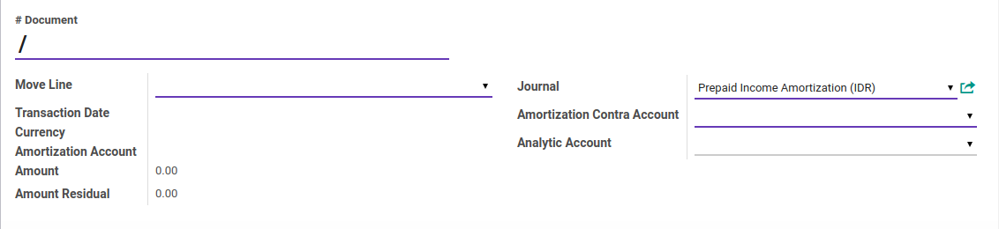
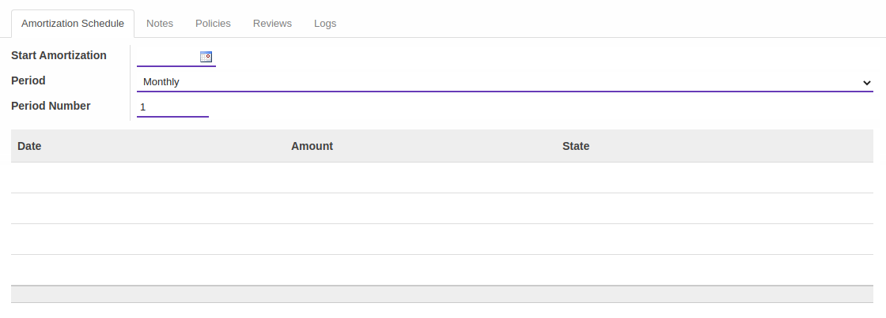
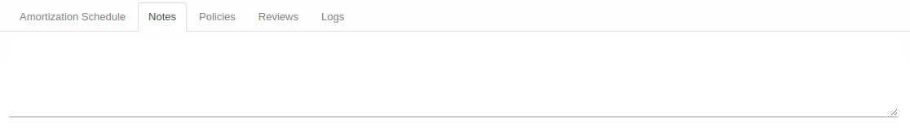
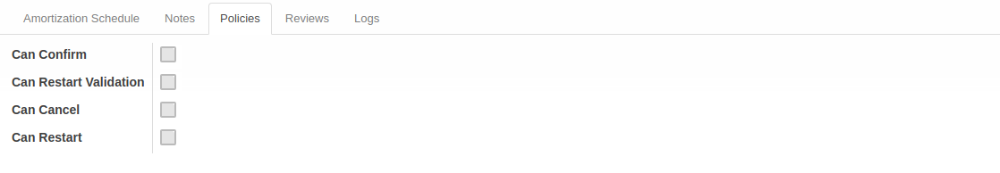
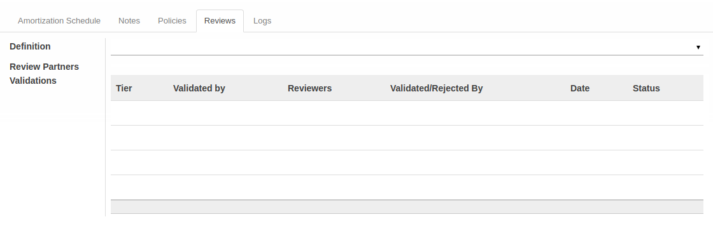
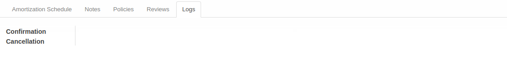

# Penjelasan Prepaid Income Amortization

Informasi pada *prepaid income amortization* dibagi menjadi beberapa bagian, yaitu:

* [Header](#bagian-header)
* [Tab Amortization Schedule](#tab-amortization-schedule)
* [Tab Notes](#tab-notes)
* [Tab Policies](#tab-policies)
* [Tab Reviews](#tab-reviews)
* [Tab Logs](#tab-logs)

### <a name="bagian-header">HEADER</a>

#### <a name="field-#document"># Document</a>

Nomor Dokumen.

#### <a name="field-move-line">Move Line</a>

Referensi transaksi.

#### <a name="field-transaction-date">Transaction Date</a>

Tanggal transaksi.

#### <a name="field-currency">Currency</a>

Mata uang yang digunakan.

#### <a name="field-amortization-account">Amortization Account</a>

Kode Akun yang digunakan.

#### <a name="field-amount">Amount</a>

Nilai prepaid income.

#### <a name="field-amount-residual">Amount Residual</a>

Nilai sisa prepaid income.

#### <a name="field-journal">Journal</a>

Nama Jurnal yang digunakan.

#### <a name="field-amortization-contra-account">Amortization Contra Account</a>

Kode akun kontra amortisasi yang digunakan.

#### <a name="field-analytic-account">Analytic Account</a>

Kode akun analitik yang digunakan.

### <a name="tab-amortization-schedule">TAB AMORTIZATION SCHEDULE</a>

#### <a name="field-start-amortization">Start Amortization</a>

Tanggal awal amortisasi.

#### <a name="field-period">Period</a>

Periode yang digunakan.

#### <a name="field-period-number">Period Number</a>

Jumlah periode yang digunakan.

#### <a name="tab-notes">TAB NOTES</a>

Catatan.

#### <a name="tab-policies">TAB POLICIES</a>

#### <a name="field-confirm">Can Confirm</a>

Kebijakan untuk dapat melakukan konfirmasi.

#### <a name="field-restart-validation">Can Restart Validation</a>

Kebijakan untuk dapat melakukan validasi Restart.

#### <a name="field-cancel">Can Cancel</a>

Kebijakan untuk dapat melakukan pembatalan.

#### <a name="field-restart">Can Restart</a>

Kebijakan untuk dapat melakukan Restart.

#### <a name="tab-reviews">TAB REVIEWS</a>

#### <a name="field-definition">Definition</a>

Definisi review yang digunakan.

#### <a name="field-review-partners-validations">Review Partners Validations</a>

Daftar partner yang melakukan validasi.

#### <a name="tab-logs">TAB LOGS</a>

#### <a name="field-confirmation">Confirmation</a>

Log aktifitas User yang melakukan konfirmasi.

#### <a name="field-cancellation">Cancellation</a>

Log aktifitas User yang melakukan pembatalan.
