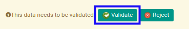

# Menyetujui Purchase Advance Settlement

## A. INPUT

* Data purchase advance settlement yang akan disetujui harus memiliki status **Waiting for Approval**.

* User yang akan menyetujui harus memiliki akses untuk menyetujui purchase advance settlement.

## B. LANGKAH KERJA

1. Buka menu **Accounting -> Settlement -> Purchase Advance Settlement**. Abaikan jika sudah berada pada menu yang dimaksud.
2. Buka data purchase advance settlement yang akan disetujui. Abaikan jika data sudah dibuka.
3. Klik tombol **Validate** pada bagian atas-kiri form.

## C. OUTPUT

* Status dari purchase advance settlement akan berubah menjadi **Ready to Process**.

