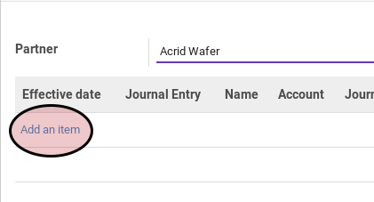

# Import Debit Line

*(Instruksi kerja ini merupakan sub instruksi dari (1) [Membuat Purchase Advance Settlement](./membuat.md), atau (2) [Memodifikasi Purchase Advance Settlement](./memodifikasi.md). Instruksi kerja ini tidak bisa berdiri sendiri)*

## A. INPUT

*(Tidak ada instruksi khusus)*

## B. LANGKAH KERJA

1. Klik tombol **Import Move Line** pada bagian **[Debit Lines](./penjelasan.md#bagian-debit-line)**

Pop-up **Import Move Line** akan muncul.

2. Klik label **Add an Item**

3. Pilih *journal item*
4. Klik tombol **Import** pada bagian bawah-kiri pop-up

5. Lakukan sampai semua *journal item* yang mau direkonsiliasi sudah terimport.
6. Lanjutkan prosedur (1) [Langkah ke-10 pada Membuat Purchase Advance Settlement](./membuat.md#langkah-10), atau (2) [Langkah ke-12 pada Memodifikasi Purchase Advance Settlement](./memodifikasi.md#langkah-10)

## C. OUTPUT

*(Tidak ada instruksi khusus)*
