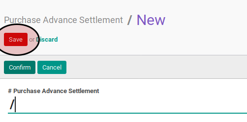

# Membuat Purchase Advance Settlement

1. Buka menu **Accounting -> Settlement -> Purchase Advance Settlement**
2. Klik tombol **Create** pada bagian atas-kiri form.

3. Ubah **[# Purchase Advance Settlement](./penjelasan.md#field-name)** dengan penomeran yang dikehendaki. Biarkan berisi **/** apabila menghendaki penomeran otomatis.
4. Ubah **[Company](./penjelasan.md#field-company)** jika dibutuhkan. Hanya terlihat pada implementasi multi-company. Harus diisi.
5. Isi **[Date](./penjelasan.md#field-date)**. Harus diisi.
6. Biarkan isian **[Period](./penjelasan.md#field-period)**.
7. Pilih **[Journal](./penjelasan.md#field-journal)**. Harus diisi.
8. Pilih **[Partner](./penjelasan.md#field-partner)** Tidak harus diisi.
9. Isi **[Exchange Rate](./penjelasan.md#field-exchange-rate)**. Harus diisi.
10. <a name="langkah-10">Untuk</a> setiap *supplier invoice* yang akan di-*settle*, lakukan [prosedur input debit line](./debit-line.md).
11. <a name="langkah-10">Untuk</a> setiap uang muka pembelian yang akan di-*settle*, lakukan [prosedur input credit line](./credit-line.md).
12. <a name="langkah-12">Klik</a> tombol **Save** pada bagian atas-kiri form.

