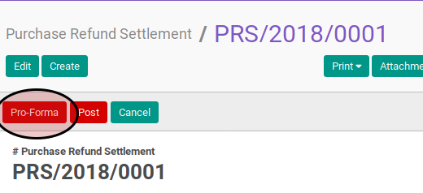

# Proforma Purchase Refund Settlement

## A. INPUT

* Data *purchase refund settlement* yang akan dijadikan proforma harus memiliki status **Ready To Process**.

* User yang akan mengkonfirmasi harus memiliki akses untuk menjadikan proforma *purchase refund settlement*.

## B. LANGKAH KERJA

1. Buka menu **Accounting -> Settlement -> Purchase Refund Settlement**. Abaikan jika sudah berada pada menu yang dimaksud.
2. Buka data *purchase refund settlement* yang akan di-*proforma*. Abaikan jika data sudah dibuka.
3. Klik tombol **Proforma** pada bagian atas-kiri form.

## C. OUTPUT

* Status dari *purchase refund settlement* akan berubah menjadi **Proforma**

