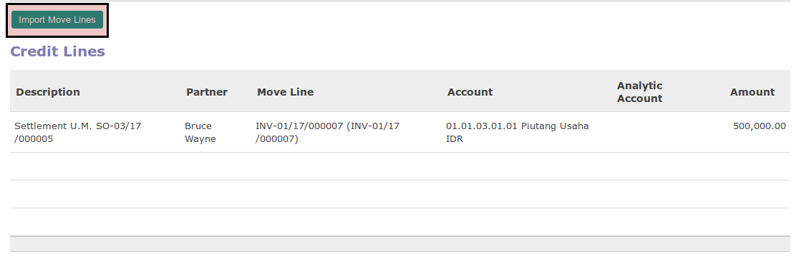
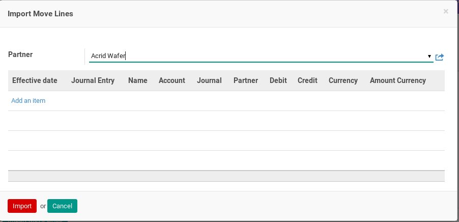
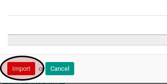

# Import Credit Line

1. Klik tombol **Import Move Line** pada bagian **[Credit Lines](./penjelasan.md#bagian-credit-line)**

Pop-up **Import Move Line** akan muncul.

2. Klik label **Add an Item**

3. Pilih *journal item*
4. Klik tombol **Import** pada bagian bawah-kiri pop-up

5. Lakukan sampai semua *journal item* yang mau direkonsiliasi sudah terimport.
6. Lanjutkan prosedur pembuatan *sale advance settlement* [langkah ke-12](./membuat.md#langkah-12)
