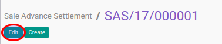
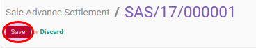

# Memodifikasi Sale Advance Settlement

## A. INPUT

* Data advance settlement yang akan dimodifikasi harus memiliki status **Draft**.

## B. LANGKAH KERJA

1. Buka menu **Accounting -> Bank & Cash -> Sale Advance Settlement**. Abaikan jika sudah berada pada menu yang dimaksud.
2. Buka data advance settlement yang akan dimodifikasi. Abaikan jika data sudah dibuka.
3. Klik tombol **Edit** pada bagian atas-kiri form.

3. Ubah dan sesuaikan **[# Sale Advance Settlement](./penjelasan.md#field-name)** dengan penomeran yang dikehendaki.
4. Ubah dan sesuaikan **[Company](./penjelasan.md#field-company)** jika dibutuhkan. Hanya terlihat pada implementasi multi-company. Harus diisi.
5. Isi dan sesuaikan **[Date](./penjelasan.md#field-date)**. Harus diisi.
6. Biarkan isian **[Period](./penjelasan.md#field-period)**.
7. Pilih **[Journal](./penjelasan.md#field-journal)**. Harus diisi.
8. Pilih **[Partner](./penjelasan.md#field-partner)** Tidak harus diisi.
9. Isi dan sesuaikan **[Exchange Rate](./penjelasan.md#field-exchange-rate)**. Harus diisi.
10. Untuk setiap uang muka penjualan yang akan di-*settle*, lakukan [prosedur input debit line](./debit-line.md).
11. <a name="langkah-11">Untuk</a> setiap *customer invoice* yang akan di-*settle*, lakukan [prosedur input credit line](./credit-line.md).
12. <a name="langkah-12">Klik</a> tombol **Save** pada bagian atas-kiri form.

## C. OUTPUT

* Data sale advance settlement akan berubah sesuai dengan perubahan yang dilakukan.
