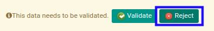

# Menolak Sale Advance Settlement

## A. INPUT

* Sale advance settlement yang dapat ditolak harus memiliki status **Waiting for Approval**.

* User yang akan menolak harus memiliki akses untuk menolak sale advance settlement.

## B. LANGKAH KERJA

1. Buka menu **Accounting -> Settlement -> Sale Advance Settlement**. Abaikan jika sudah berada pada menu yang dimaksud.
2. Buka data sale advance settlement yang akan ditolak. Abaikan jika data sudah dibuka.
3. Klik tombol **Reject** pada bagian atas-kiri form.

## C. OUTPUT

* Data sale advance settlement telah ditolak.

