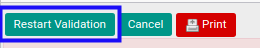
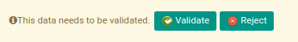

# Merestart Persetujuan Sale Advance Settlement

## A. INPUT

* Sale advance settlement yang dapat direstart persetujuan harus memiliki status **Waiting for Approval**.

* Sale advance settlement yang dapat direstart persetujuan harus memiliki kondisi **Operation has been rejected**.

* User yang akan merestart persetujuan harus memiliki akses untuk merestart persetujuan sale advance settlement.

## B. LANGKAH KERJA

1. Buka menu **Accounting -> Settlement -> Sale Advance Settlement**. Abaikan jika sudah berada pada menu yang dimaksud.
2. Buka data sale advance settlement yang akan direstart persetujuan. Abaikan jika data sudah dibuka.
3. Klik tombol **Restart Validation** pada bagian atas-kiri form.

## C. OUTPUT

* Data sale advance settlement telah dapat dilakukan persetujuan.

