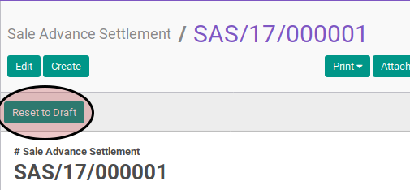

# Merestart Sale Advance Settlement

## A. INPUT

* Data *sale advance settlement* yang akan direstart harus memiliki status **Cancelled**.

* User yang akan merestart harus memiliki akses untuk merestart *sale advance settlement*.

## B. LANGKAH KERJA

1. Buka menu **Accounting -> Settlement -> Sale Advance Settlement**. Abaikan jika sudah berada pada menu yang dimaksud.
2. Buka data *sale advance settlement* yang akan di-*restart*. Abaikan jika data sudah dibuka.
3. Klik tombol **Reset to Draft** pada bagian atas-kiri form.

## C. OUTPUT

* Status dari *sale advance settlement* akan berubah menjadi **Draft**

* Isian *sale advance settlement* dapat diubah
