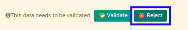

# Menolak Sale Refund Settlement

## A. INPUT

* Sale refund settlement yang dapat ditolak harus memiliki status **Waiting for Approval**.

* User yang akan menolak harus memiliki akses untuk menolak sale refund settlement.

## B. LANGKAH KERJA

1. Buka menu **Accounting -> Settlement -> Sale Refund Settlement**. Abaikan jika sudah berada pada menu yang dimaksud.
2. Buka data sale refund settlement yang akan ditolak. Abaikan jika data sudah dibuka.
3. Klik tombol **Reject** pada bagian atas-kiri form.

## C. OUTPUT

* Data sale refund settlement telah ditolak.

