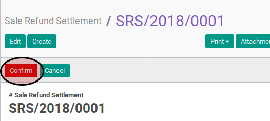

# Post Sale Refund Settlement

## A. INPUT

* Data *sale refund settlement* yang akan di-*post* harus memiliki status **Ready To Process**, atau **Proforma**.

* User yang akan memposting harus memiliki akses untuk memposting *sale refund settlement*.

## B. LANGKAH KERJA

1. Buka menu **Accounting -> Settlement -> Sale Refund Settlement**. Abaikan jika sudah berada pada menu yang dimaksud.
2. Buka data *sale refund settlement* yang akan di-*posting*. Abaikan jika data sudah dibuka.
3. Klik tombol **Post** pada bagian atas-kiri form. Pop-up form berjudul **Post Voucher**
akan muncul

4. Isi **Date** pada pop-up form **Post Voucher**
5. Klik tombol **Post** pada bagian bawah-kiri pop-up form **Post Voucher**

## C. OUTPUT

* Status dari *sale refund settlement* akan berubah menjadi **Posted**

* Penjurnalan *sale refund settlement* akan secara otomatis dibuat. Penjurnalan dapat dilihat pada tab **Accounting Information**. Isian **Accounting Entry** akan berisi journal entry yang dihasilkan. Sementara di bawah isian **Accounting Entry** akan memperlihatkan journal item dari penjurnalan *sale refund settlement*.

* Penjurnalan *sale refund settlement* akan mengikuti pedoman sebagai berikut:

    * n buah *journal item* akan terbentuk dengan ketentuan sebagai berikut:

        * n sama dengan jumlah *debit line*.
        * Akun yang digunakan sama dengan isian **Account** pada tiap *debit line*
        * *Debit line* dengan isian **Amount** yang bernilai positif akan didebit sejumlah nilai **Amount In Company Currency At Voucher Date**. *Debit line* dengan isian **Amount** yang bernilai negatif akan dikredit sejumlah nilai **Amount In Company Currency At Voucher Date**.

    * m buah *journal item* akan terbentuk dengan ketentuan sebagai berikut:

        * m sama dengan jumlah *credit line*.
        * Akun yang digunakan sama dengan isian **Account** pada tiap *credit line*
        * *Credit line* dengan isian **Amount** yang bernilai positif akan dikredit sejumlah nilai **Amount In Company Currency At Voucher Date**. *Credit line* dengan isian **Amount** yang bernilai negatif akan didebit sejumlah nilai **Amount In Company Currency At Voucher Date**.
