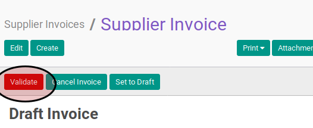

# Menyetujui Supplier Invoice

## A. INPUT

* Data *supplier invoice* yang akan distujui harus memiliki status **Waiting for Approval**.

* User yang akan menyetujui harus memiliki akses untuk menyetujui *supplier invoice*.

## B. LANGKAH KERJA

1. Buka menu **Accounting -> Supplier -> Supplier Invoice**. Abaikan jika sudah berada
pada menu yang dimaksud.
2. Buka data *supplier invoice* yang akan disetujui. Abaikan jika data sudah dibuka.
3. Klik tombol **Validate** pada bagian atas-kiri form.

## C. OUTPUT

* Status dari *supplier invoice* akan berubah menjadi **Open**

* Penjurnalan *supplier invoice* akan otomatis terbentuk.
* Penjurnalan *supplier invoice* akan mengikuti ketentuan sebagai berikut:

    * Satu buah *journal item* akan terbentuk dengan ketentuan sebagai berikut:

        * Akun yang akan digunakan akan sesuai dengan isian **[Account](./penjelasan.md#field-account)**
        * Akun akan dikredit sejumlah nilai **[Total](./penjelasan.md#field-total)** yang sudah dikonversi ke dalam mata uang perusahaan.
        * Apabila isian **[Currency](./penjelasan.md#field-currency)** berbeda dengan mata uang perusahaan, maka (1) nilai **Currency** pada *journal item* yang terbentuk akan sama dengan isian **[Currency](./penjelasan.md#field-currency)**, dan (2) nilai **Amount Currency** akan sama dengan nilai **[Total](./penjelasan.md#field-total)**

    * *n* buah *journal item* akan terbentuk dengan ketentuan sebagai berikut:

        * *n* sama dengan jumlah *invoice line* yang dimiliki oleh *supplier invoice*
        * Akun yang akan digunakan akan sesuai dengan isian **[Account](./penjelasan.md#field-account-line)**
        * Apabila nilai **[Sub Total](./penjelasan.md#field-sub-total)** bernilai positif maka akun akan didebit sejumlah yang sama dengan nilai **[Sub Total](./penjelasan.md#field-subtotal)** dalam mata uang perusahaan. Apabila nilai **[Sub Total](./penjelasan.md#field-subtotal)** bernilai negatif maka akun akan dikredit sejumlah yang sama dengan nilai **[Sub Total](./penjelasan.md#field-subtotal)** dalam mata uang perusahaan.
        * Apabila isian **[Currency](./penjelasan.md#field-currency)** berbeda dengan mata uang perusahaan, maka (1) nilai **Currency** pada *journal item* yang terbentuk akan sama dengan isian **[Currency](./penjelasan.md#field-currency)**, dan (2) nilai **Amount Currency** akan sama dengan nilai **[Total](./penjelasan.md#field-currency)**

    * *m* buah *journal item* akan terbentuk dengan ketentuan sebagai berikut:

        * *m* akan sama dengan jumlah data tabel **[Tax Lines](./penjelasan.md#tabel-taxline)**
        * Akun yang akan digunakan akan sesuai dengan isian **[Tax Account](./penjelasan.md#field-tax-account)**
        * Apabila nilai **[Amount](./penjelasan.md#field-tax-amount)** bernilai positif maka akun akan didebit sejumlah yang sama dengan nilai **[Amount](./penjelasan.md#field-tax-amount)** dalam mata uang perusahaan. Apabila nilai **[Amount](./penjelasan.md#field-tax-amount)** bernilai negatif maka akun akan dikredit sejumlah yang sama dengan nilai **[Amount](./penjelasan.md#field-tax-amount)** dalam mata uang perusahaan.        
