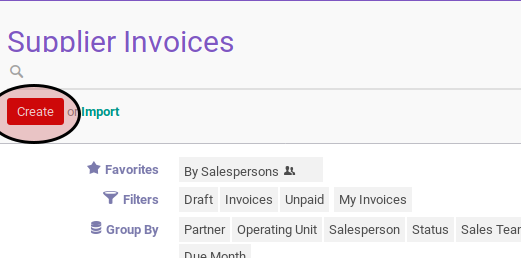

# Secara Manual

1. Buka menu **Accounting -> Supplier -> Supplier Invoice**. Abaikan jika sudah berada pada menu yang dimaksud.
2. Klik tombol **Create** pada bagian atas-kiri form.

3. Isi **[Supplier](./penjelasan.md#field-supplier)**. Wajib diisi.
4. Abaikan **[Fiscal Position](./penjelasan.md#field-fiscal-position)**.
5. Isi **[Source Document](./penjelasan.md#field-source-document)**. Tidak wajib diisi.
6. Isi **[Supplier Invoice Number](./penjelasan.md#field-supplier-invoice-number)**. Tidak wajib diisi.
7. Isi **[Payment Reference](./penjelasan.md#field-payment-reference)**. Tidak wajib diisi.
8. Isi **[Invoice Date](./penjelasan.md#field-invoice-date)**. Wajib diisi.
9. Isi **[Due Date](./penjelasan.md#field-due-date)**. Wajib diisi.
10. Pilih **[Account](./penjelasan.md#field-account)**. Wajib diisi.
11. Isi **[Force Number](./penjelasan.md#field-force-number)**. Tidak wajib diisi.
12. Pilih **[Operating Unit](./penjelasan.md#field-ou)**. Tidak wajib diisi.
13. Pilih **[Journal](./penjelasan.md#field-journal)**. Wajib diisi.
14. Pilih **[Currency](./penjelasan.md#field-currency)**. Wajib diisi.
15. Beralih ke tab **[Other Info](./penjelasan.md#penjelasan-tab-other-info)**.
16. Pilih **[Account](./penjelasan.md#field-account)**. Wajib diisi.
17. Pilih **[Responsible](./penjelasan.md#field-responsible)**. Tidak wajib diisi.
18. Pilih **[Payment Term](./penjelasan.md#field-payment)**. Tidak wajib diisi.
19. Abaikan **[Accounting Period](./penjelasan.md#field-accounting-period)**.
20. Untuk setiap detail invoice lakukan prosedur pengisian *[invoice line](./membuat-manual-invoice-line.md)*
21. Beralih ke tab **[Invoice Lines](./penjelasan.md#penjelasan-tab-invoice-line)**.
23. Isi **[Additional Information](./penjelasan.md#field-additional-information)** Tidak wajib diisi.
24. Klik label **Update** pada bagian bawah-kanan

25. Klik tombol **Save** pada bagian atas-kiri form.

