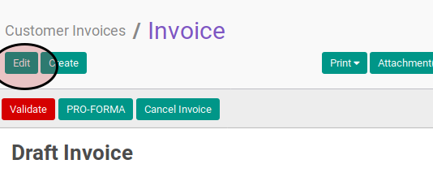
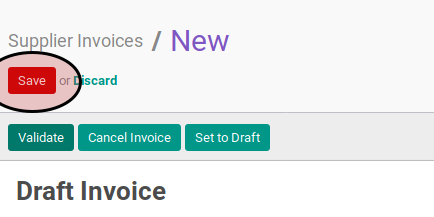

# Memodifikasi Supplier Invoice

## A. INPUT

* Data *supplier invoice* yang akan dimodifikasi harus memiliki status **Draft**.

## B. LANGKAH KERJA

1. Buka menu **Accounting -> Supplier -> Supplier Invoice**. Abaikan jika sudah berada pada menu yang dimaksud.
2. Buka data supplier invoice yang akan dimodifikasi. Abaikan jika data sudah dibuka.
3. Klik tombol **Edit** pada bagian atas-kiri form.

4. Isi dan sesuaikan **[Supplier](./penjelasan.md#field-supplier)** jika dibutuhkan. Wajib diisi.
5. Abaikan **[Fiscal Position](./penjelasan.md#field-fiscal-position)**.
6. Isi dan sesuaikan **[Source Document](./penjelasan.md#field-source-document)** jika dibutuhkan. Tidak wajib diisi.
7. Isi dan sesuaikan **[Supplier Invoice Number](./penjelasan.md#field-supplier-invoice-number)** jika dibutuhkan. Tidak wajib diisi.
8. Isi dan sesuaikan **[Payment Reference](./penjelasan.md#field-payment-reference)** jika dibutuhkan. Tidak wajib diisi.
9. Isi dan sesuaikan **[Invoice Date](./penjelasan.md#field-invoice-date)** jika dibutuhkan. Wajib diisi.
10. Isi dan sesuaikan **[Due Date](./penjelasan.md#field-due-date)** jika dibutuhkan. Wajib diisi.
11. Pilih dan sesuaikan **[Account](./penjelasan.md#field-account)** jika dibutuhkan. Wajib diisi.
12. Isi dan sesuaikan **[Force Number](./penjelasan.md#field-force-number)** jika dibutuhkan. Tidak wajib diisi.
13. Pilih dan sesuaikan **[Operating Unit](./penjelasan.md#field-ou)** jika dibutuhkan. Tidak wajib diisi.
14. Pilih dan sesuaikan **[Journal](./penjelasan.md#field-journal)** jika dibutuhkan. Wajib diisi.
15. Pilih dan sesuaikan **[Currency](./penjelasan.md#field-currency)** jika dibutuhkan. Wajib diisi.
16. Beralih ke tab **[Other Info](./penjelasan.md#penjelasan-tab-other-info)**.
17. Pilih dan sesuaikan **[Account](./penjelasan.md#field-account)** jika dibutuhkan. Wajib diisi.
18. Pilih dan sesuaikan **[Responsible](./penjelasan.md#field-responsible)** jika dibutuhkan. Tidak wajib diisi.
19. Pilih dan sesuaikan **[Payment Term](./penjelasan.md#field-payment)** jika dibutuhkan. Tidak wajib diisi.
20. Abaikan **[Accounting Period](./penjelasan.md#field-accounting-period)**.
21. <a name="l21">[Tambah](./membuat-manual-invoice-line.md)/[Modifikasi](./modifikasi-invoice-line.md)/[Hapus](./menghapus-invoice-line.md) **Invoice Lines**</a>. Ulangi langkah ini sampai **Invoice Lines** sesuai dengan keinginan.
22. Beralih ke tab **[Invoice Lines](./penjelasan.md#penjelasan-tab-invoice-line)**.
23. Isi dan sesuaikan **[Additional Information](./penjelasan.md#field-additional-information)** jika dibutuhkan. Tidak wajib diisi.
24. Klik label **Update** pada bagian bawah-kanan

25. Klik tombol **Save** pada bagian atas-kiri form.

## C. OUTPUT

* Data customer invoice akan berubah sesuai dengan perubahan yang dilakukan.
