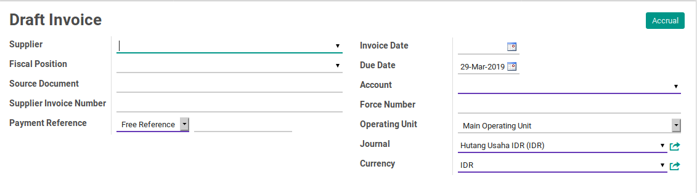

# Penjelasan

* [Header](#bagian-header)
* [Tab Invoice Line](#bagian-invoice-line)
* [Tab Other Info](#bagian-other-info)
* [Tab Payments](#bagian-payment)
* [Tab Policy](#bagian-policy)
* [Tab Pickings](#bagian-picking)

### <a name="bagian-header">HEADER</a>

#### <a name="field-partner">Supplier</a>

Supplier

#### <a name="field-fiscal-position">Fiscal Position</a>

#TODO

#### <a name="field-source-document">Source Document</a>

Dokumen sumber

#### <a name="field-supplier-invoice-number">Supplier Invoice Number</a>

Nomor invoice yang diberikan oleh supplier

#### <a name="field-payment-reference">Payment Reference</a>

#TODO

#### <a name="field-invoice-date">Invoice Date</a>

Tanggal terbitnya invoice. Tanggal ini akan menjadi tanggal penjurnalan *supplier invoice*

#### <a name="field-due-date">Due Date</a>

Tanggal jatuh tempo. Jika isian **_Payment Term_** diisi, maka nilai **_Due Date_** akan mengikuti ketentuan **_Payment Term_**.

#### <a name="field-account">Account</a>

Akun piutang yang akan digunakan dalam penjurnalan *supplier invoice*. Secara otomatis akan mengambil nilai **Payable Account_** pada **_Supplier_**.

#### <a name="field-force-number">Force Number</a>

Nomor invoice internal. Biarkan kosong agar penomeran invoice dibuat secara otomatis.

#### <a name="field-ou">Operating Unit</a>

Operating unit

#### <a name="field-journal">Journal</a>

Buku jurnal yang digunakan untuk mencatat penjurnalan *supplier invoice*

#### <a name="field-currency">Currency</a>

Mata uang invoice. Akan mengikuti nilai **_Currency_** pada **_Journal_**.

### <a name="bagian-invoice-line">TAB INVOICE LINE</a>

#### <a name="field-product">Product</a>

Produk yang dibeli.

#### <a name="field-description">Description</a>

Deskripsi item yang dibeli. Secara default akan bernilai sesuai dengan nama **_Product_**.

#### <a name="field-account-line">Account</a>

Akun beban yang akan digunakan dalam penjurnalan *supplier invoice*.

#### <a name="field-aa">Analytic Account</a>

Kode biaya

#### <a name="field-asset">Asset</a>

#TODO

#### <a name="field-start-date">Start Date</a>

Tanggal mulai masa manfaat. Diisi apabila isian **_Account_** merupakan akun beban dibayar dimuka.

#### <a name="field-end-date">End Date</a>

Tanggal selesai masa manfaat. Diisi apabila isian **_Account_** merupakan akun beban dibayar dimuka.

#### <a name="field-qty">Quantity</a>

Kuantitas item yang dibeli

#### <a name="field-uom">Unit of Measure</a>

Satuan item yang dibeli

#### <a name="field-asset">Unit Price</a>

Harga satuan item yang dibeli

#### <a name="field-discount">Discount</a>

Diskon pembelian. Ditulis dalam persen.

#### <a name="field-taxes">Taxes</a>

Pajak-pajak yang dikenakan kepada item yang dibeli.

#### <a name="field-amount-gross">Amount Gross</a>

Subtotal sebelum pajak

#### <a name="field-subtotal">Subtotal</a>

Subtotal penjualan sebelum pajak

#### <a name="field-tax">Tax</a>

Total pajak yang dikenakan

#### <a name="field-total">Total</a>

**_Subtotal_** + **_Tax_**

#### <a name="field-balance">Balance</a>

Sisa invoice yang belum dibayar.

#### <a name="field-tax-description">Tax Description</a>

Keterangan item pajak

#### <a name="field-tax-account">Tax Account</a>

Kode akun pajak

#### <a name="field-base">Base</a>

Dasar penggenaan pajak

#### <a name="field-tax-amount">Amount</a>

Pajak

#### <a name="field-info">Additional Information</a>

Informasi tambahan

### <a name="bagian-other-info">TAB OTHER INFO</a>

#### <a name="field-bank-acc">Bank Account</a>

Rekening tujuan penerimaan pembayaran

#### <a name="field-salesperson">Responsible</a>

Karyawan yang bertanggung jawab menerima invoice

#### <a name="field-payment-term">Payment Term</a>

Term jatuh tempo pembayaran

#### <a name="field-journal-entry">Journal Entry</a>

Penjurnalan yang dihasilkan oleh *supplier invoice*

### <a name="bagian-payment">TAB PAYMENT</a>

Tabel payment akan berisi *journal item* yang merekonsiliasi *supplier invoice*

### <a name="bagian-policy">TAB POLICY</a>

### <a name="bagian-picking">TAB PICKING</a>

Tabel picking akan berisi data *picking* yang mengotomasi pembuatan *supplier invoice*
